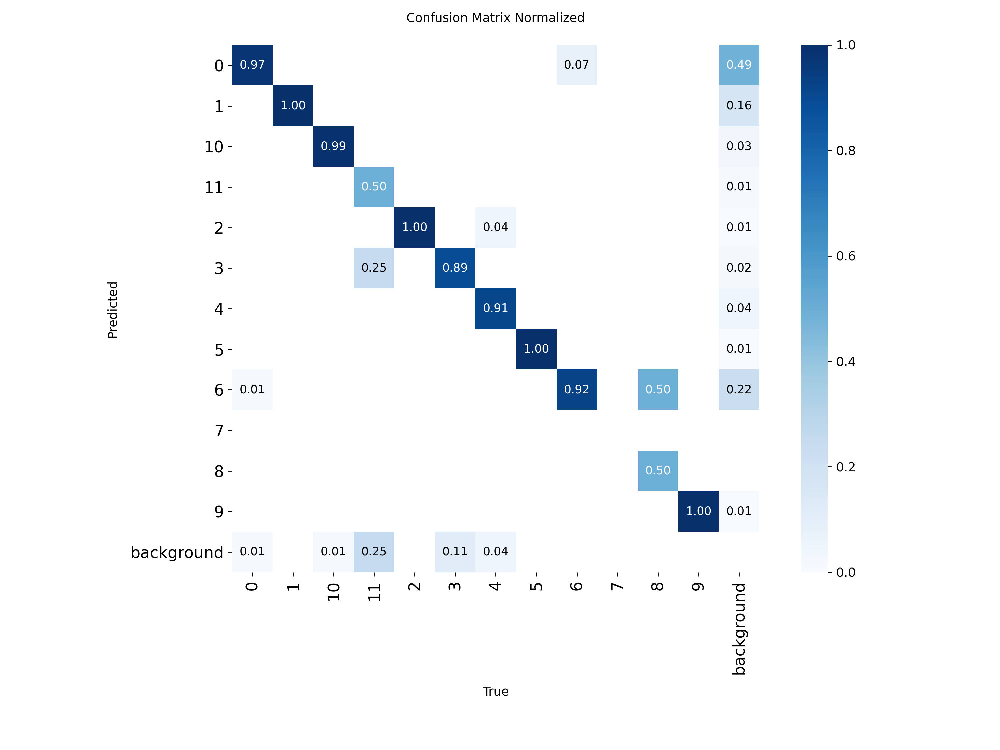
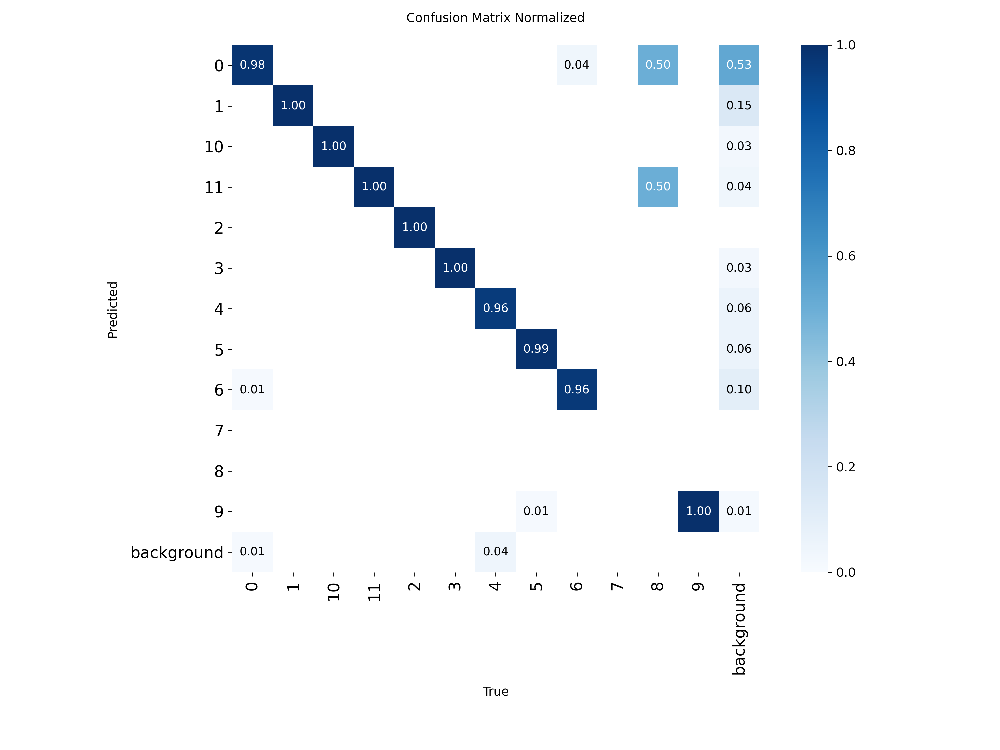
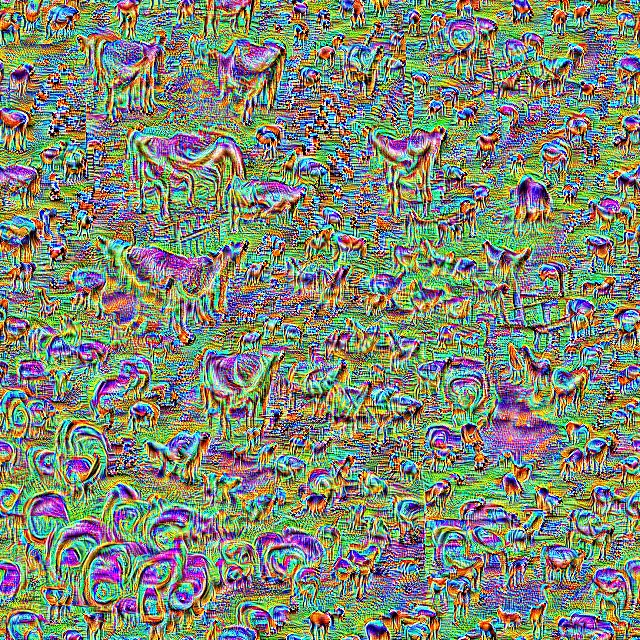
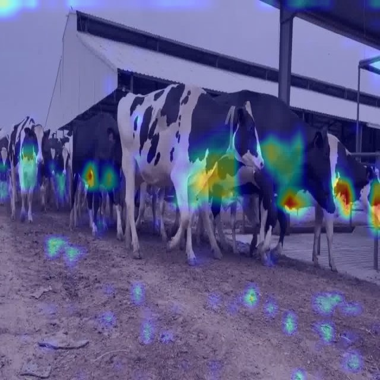
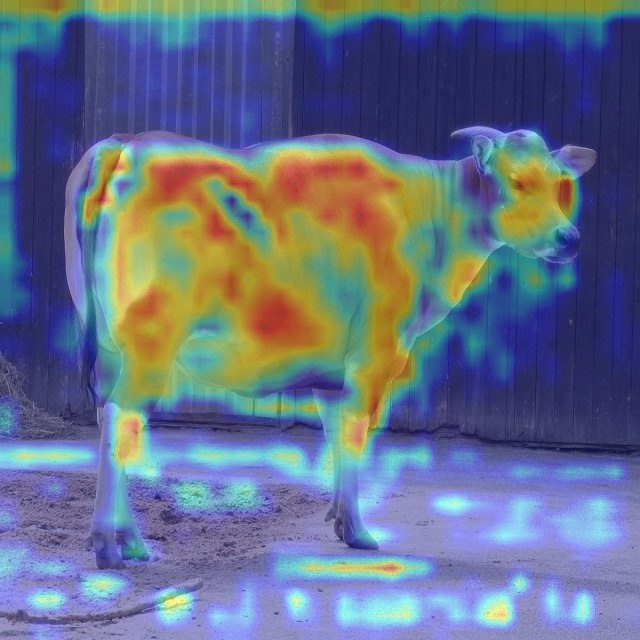
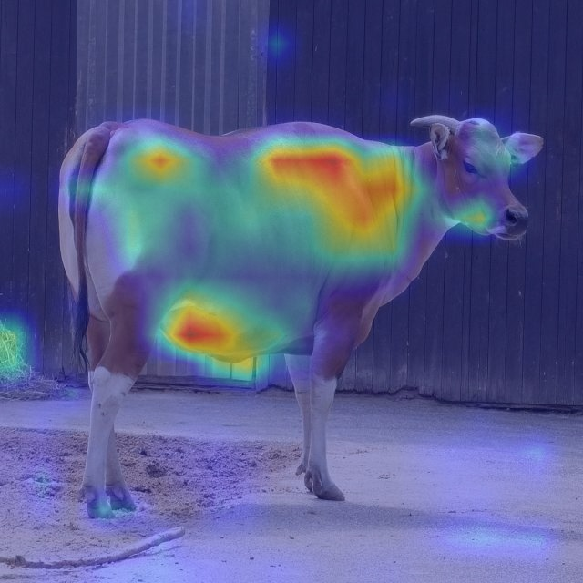
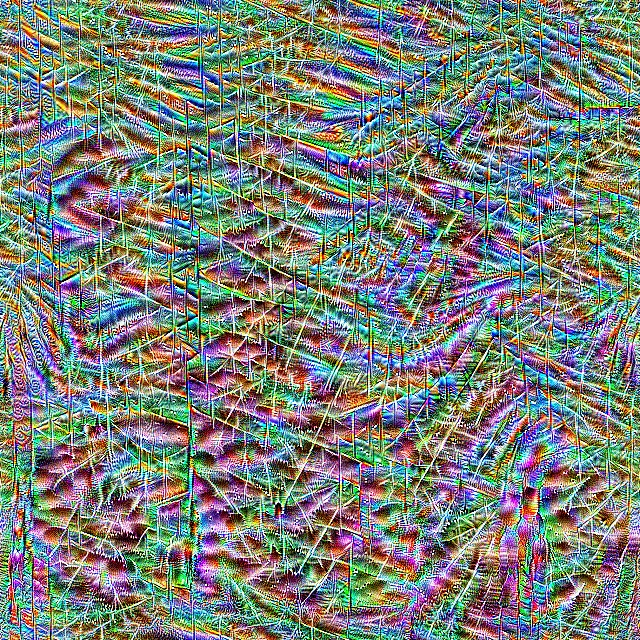

I have fine tuned two models:
    yolov8 and rtdetr

yolo

rtdetr

I believe results are alright. 

I used two methods to understand these models:
    grad-cam and activation maxing

I understood grad-cam method that it highlights
how certain layer activates on certain image. basically 
it shows how much each part of image influences a layer

I understood activation maxing as method that, well, tries to make
an image out of values defined in layer. This way we get hallucinated
images which define "features" that layer tries to find. 

if grad-cam shows which parts influenced layer the most, activation maxing is 
somewhat like a reverse of it. So if grad max shows us which parts are important
at certain layer, activation maximization is going to show abstract representation
of the parts.

With that said, here is some interesting images:

here is for example layer 18 of yolo:

(it looks like this layer likes to hallucinate torsos)

here are some for detr:

